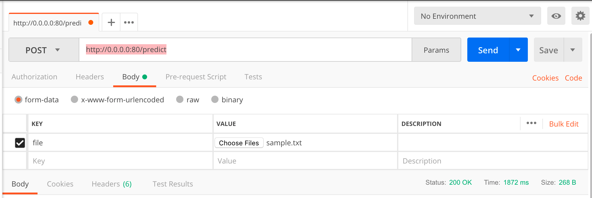
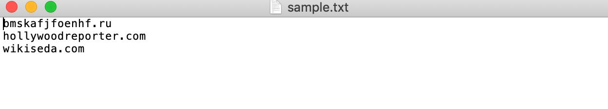
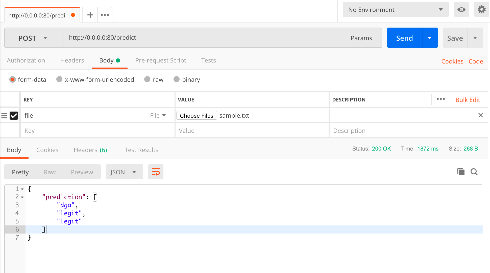
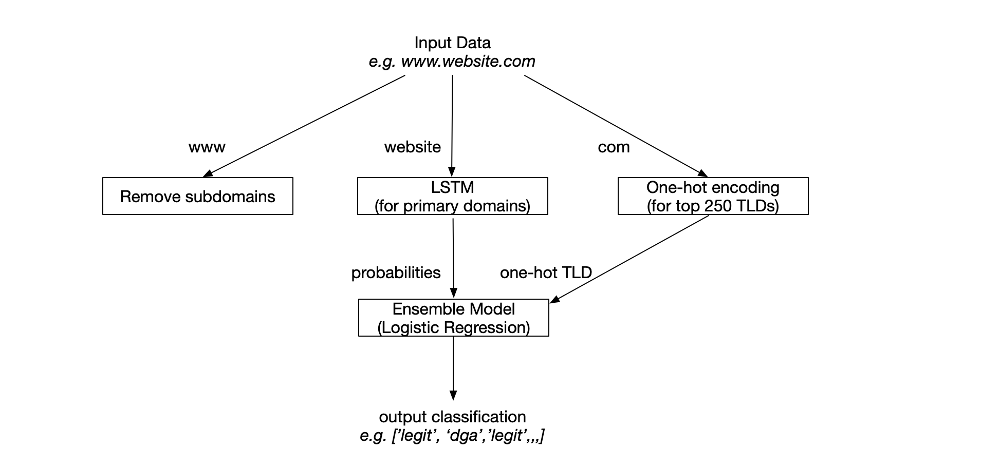

# Domain Generation Algorithm Detector

**Rachel Qu - Coding Challenge - Jan 28, 2018**

This project aims to rapdily research, build, and deploy a machine learning system to detect domain names which are likely generated by malware. Based on some research, three machine learning models were built in this project. Bigram classifier acted as baseline here. LSTM showed a better performance than bigram classifier. An ensemble model that use predicted results of LSTM and one-hot encoding of common TLD information achieved the best performance. It's the ensemble model that went into service. 

**Content:**

* Get Predictions 
	- if you want to get predicted results back, please follow steps in this section.

* Project Details
	- if you want to learn more about the project details, including data preparation, model training and evaluation, please check information in this section. 
 


## Get Predictions

### Step1: Build Docker  

To get predicted results on unseen data, first you need to get docker ready. Two choices are availabe here. You can either choose to build docker image on your machine, or you can click the link below to download a built image from drive. 

* Follow steps below to build docker on your machine: 

	Open a new terminal window and type these commands:

	```
	$ git clone http://github.com/miaWallace0618/DGA_Detection.git
	$ cd DGA_Detection
	$ sudo docker build -t dga_detection .
	$ sudo docker run -p 80:80 dga_detecion:latest
	```

* Click this link below to download the built image from drive diretly:
	https://drive.google.com/file/d/1DXPTtse12P29IwuEX8IdJNiiVWB_OaNS/view?usp=sharing
	
	Then load the downloaded image by typing the following commands in a terminal window: 
	
	```
	$ sudo docker load < path_to_dga_detection.tar
	$ sudo docker run -p 80:80 dga_detection:latest
	```


### Step2: Get Predicted Results

When docker is ready, you can get your predicted results back by calling REST API service. The tool used here to send unseen data is Postman. Please follow the steps below carefully to get your predictions. 

1. Select **POST** method and type the url **http://0.0.0.0:80/predict** into the Params in Postman. 
2. Under **Body** tab, select **form-data** button.
3. Under **KEY** section, select **File** from the dropdown list and type **file** in the textbox.
4. Click **Choose File** button and upload your unseen data as a .txt file. 

5. Your .txt file should formatted to have one URL in each line. Each URL should contain domain information and TLD information. There shouldn't be 'ctl-A' delimiter at the end of each line. A .txt file named **sample.txt** is a sample file provided. A screenshot of sample input data is shown below: 

6. After loaded the .txt file containing unseen data, click on **Send** button. The predicted results should be returned as a list. Sample results are shown below:



## Project Details

Data preparation, model training and evaluation are contained in **DGA_Detecion.ipynb**. 

Basic idea of this project is using ensemble method to improve performance and robustness of model. First, data was cleaned, including removing subdomains, seperating primary domains and TLDs. Then a LSTM model is built on primary domains only. After got the probabilities of LSTM model, the probabilities were combined with the one-hot encoding results of top 250 common TLDs in dataset to build the final model. The overall architecture of the final proposed DGA detecion model is shown below:




#### References 
* Ryan R. Curtin, Andrew B. *Gardner. Detecting DGA Domains with Recurrent Neural Networks and Side Information*. arXiv. Oct 4, 2018.
* Hyrum Anderson, Jonathan Woodbridge. *Using Deep Learning To Detect DGAs*. EndGame. Nov 18, 2016. 
* Anonymous authors. *Character Level Based Detection of DGA Domain Names*. ICLR. 2018.